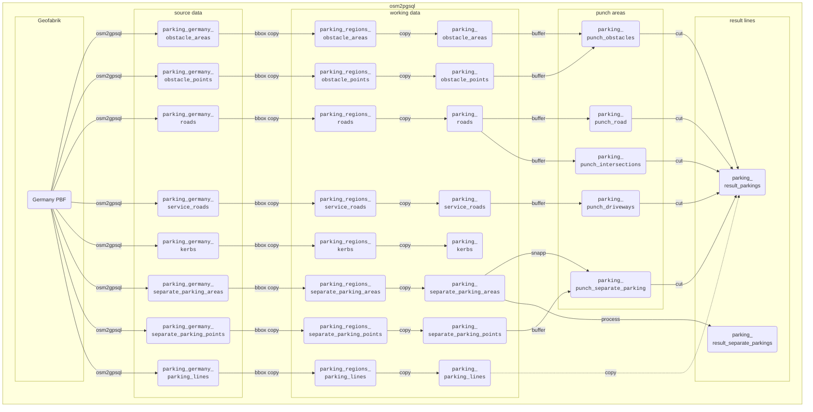

# Tables

This shows the tablesnames and a high level process on how they are created in osm2pgsql or SQL.

```mermaid
%%{init: {"flowchart": {"htmlLabels": true}} }%%
flowchart TB
    subgraph sql ["osm2pgsql"]
        subgraph osm ["Geofabrik"]
            nn("Germany PBF")
        end
        subgraph sg_table ["source data"]
            nn -->|"osm2gpsql"| SGOA("<code>parking_germany_<br>obstacle_areas</code>")
            nn -->|"osm2gpsql"| SGOP("<code>parking_germany_<br>obstacle_points</code>")
            nn -->|"osm2gpsql"| SGR("<code>parking_germany_<br>roads</code>")
            nn -->|"osm2gpsql"| SGSR("<code>parking_germany_<br>service_roads</code>")
            nn -->|"osm2gpsql"| SGK("<code>parking_germany_<br>kerbs</code>")
            nn  -->|"osm2gpsql"| SGSPA("<code>parking_germany_<br>separate_parking_areas</code>")
            nn  -->|"osm2gpsql"| SGSPP("<code>parking_germany_<br>separate_parking_points</code>")
            nn -->|"osm2gpsql"| SGPL("<code>parking_germany_<br>parking_lines</code>")
            %% We copy all roads and add the attribute parking=yes, parking=missing.
            %% We handle dual carridgeway as parking=not_expected
            %% We copy service_roads only on those cases where there is explicit parking as parking=yes
            %% We add highway=\* so we can see the service roads.
            %% DELETE: SGPL1:::labelStyle@{label: "fa:fa-tag roads with parking"} -.- SGPL
            %% DELETE: SGPL2:::labelStyle@{label: "fa:fa-tag service roads with parking"} -.- SGPL
        end
    end
    subgraph sql ["SQL"]
        subgraph init_step ["working data"]
            SGOA -->|"bbox copy"| SROA("<code>parking_regions_<br>obstacle_areas</code>")
            SGOP -->|"bbox copy"| SROP("<code>parking_regions_<br>obstacle_points</code>")
            SGR -->|"bbox copy"| SRR("<code>parking_regions_<br>roads</code>")
            SGSR  -->|"bbox copy"| SRSR("<code>parking_regions_<br>service_roads</code>")
            SGK  -->|"bbox copy"| SRK("<code>parking_regions_<br>kerbs</code>")
            SGPL  -->|"bbox copy"| SRPL("<code>parking_regions_<br>parking_lines</code>")
            SGSPA  -->|"bbox copy"| SRSPA("<code>parking_regions_<br>separate_parking_areas</code>")
            SGSPP  -->|"bbox copy"| SRSPP("<code>parking_regions_<br>separate_parking_points</code>")

            SROA -->|"copy"| OA("<code>parking_<br>obstacle_areas</code>")
            SROP -->|"copy"| OP("<code>parking_<br>obstacle_points</code>")
            SRR -->|"copy"| R("<code>parking_<br>roads</code>")
            SRSR  -->|"copy"| SR("<code>parking_<br>service_roads</code>")
            SRK  -->|"copy"| K("<code>parking_<br>kerbs</code>")
            SRPL  -->|"copy"| PL("<code>parking_<br>parking_lines</code>")
            SRSPA  -->|"copy"| PA("<code>parking_<br>separate_parking_areas</code>")
            SRSPP  -->|"copy"| PP("<code>parking_<br>separate_parking_points</code>")
        end
        subgraph punch ["punch areas"]
            OA -->|"buffer"| PAO("<code>parking_<br>punch_obstacles</code>")
            OP -->|"buffer"| PAO
            R -->|"buffer"| PARA("<code>parking_<br>punch_road</code>")
            SR  -->|"buffer"| PAD("<code>parking_<br>punch_driveways</code>")
            R -->|"buffer"| PAC("<code>parking_<br>punch_intersections</code>")
            PA  -->|"snapp"| PSP("<code>parking_<br>punch_separate_parking</code>")
            PP  -->|"buffer"| PSP
        end
        subgraph result ["result lines"]
            PL -.->|"copy"| RPL
            PA -->|"process"| RSPL("parking_<br>result_separate_parkings")
            PARA -->|"cut"| RPL("parking_<br>result_parkings")
            PAO -->|"cut"| RPL
            PAD -->|"cut"| RPL
            PAC -->|"cut"| RPL
            PSP -->|"cut"| RPL
        end
    end

classDef labelStyle fill:lightgray,stroke:white,stroke-width:1px;
```

Tooling: Test chart in https://www.mermaidchart.com/app/projects
